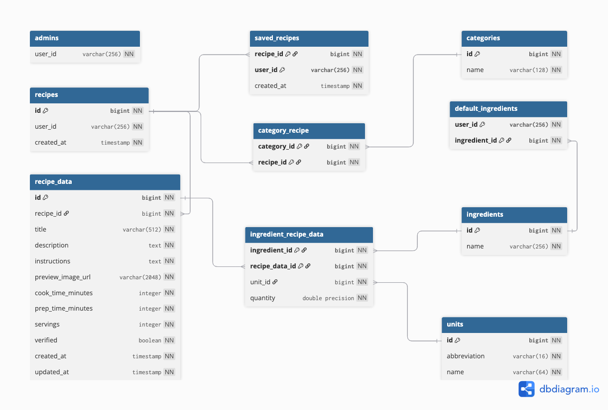

# Find Your Dinner. - Full-stack web app dokumentációja

Előfeltételek: [Find Your Dinner. - Dokumentáció, Előfeltételek](../README.md#előfeltételek)

## Tartalomjegyzék

- [1. Használt technológiák](#1-használt-technológiák)
- [2. Production környezet](#2-production-környezet)
- [3. Környezeti változók](#3-környezeti-változók)
- [4. Adatbázis](#4-adatbázis)
  - [4.1. Ábra generálása](#41-ábra-generálása)
  - [4.2. Migrációk](#42-migrációk)
    - [4.2.1. Migrációs munkafolyamat](#421-migrációs-munkafolyamat)
    - [4.2.2. Séma közvetlen alkalmazása (push)](#422-séma-közvetlen-alkalmazása-push)
  - [4.3. Seedelés](#43-seedelés)
  - [4.4. Drizzle Studio](#44-drizzle-studio)
- [5. API dokumentáció (Swagger)](#5-api-dokumentáció-swagger)
  - [5.1. API dokumentáció generálása](#51-api-dokumentáció-generálása)
    - [5.1.1. Első generáláshoz használt prompt](#511-első-generáláshoz-használt-prompt)
    - [5.1.2. Frissítéshez használt prompt](#512-frissítéshez-használt-prompt)
  - [5.2. Válaszformátumok](#52-válaszformátumok)
    - [5.2.1. Paginált válasz](#521-paginált-válasz)
    - [5.2.2. Módosítási és törlési válaszok](#522-módosítási-és-törlési-válaszok)
    - [5.2.3. `canBeDeleted` mező](#523-canbedeleted-mező)
    - [5.2.4. Hibaválaszok](#524-hibaválaszok)
- [6. Autentikáció és jogosultságkezelés](#6-autentikáció-és-jogosultságkezelés)
  - [6.1. Jogosultsági szintek](#61-jogosultsági-szintek)
    - [6.1.1. Adminisztrátor hozzáadása](#611-adminisztrátor-hozzáadása)
    - [6.1.2. Adminisztrátori jogosultág ellenőrzése](#612-adminisztrátori-jogosultág-ellenőrzése)
- [7. Segédfüggvények](#7-segédfüggvények)
  - [7.1. Kliens oldali segédfüggvények](#71-kliens-oldali-segédfüggvények-websrclib)
    - [7.1.1. HTTP kliens](#711-http-kliens-websrclibapits)
    - [7.1.2. React Query konfigurációk](#712-react-query-konfigurációk-websrclibqueriests)
    - [7.1.3. Zod sémák és validáció](#713-zod-sémák-és-validáció-websrclibzod)
    - [7.1.4. Egyéb segédfüggvények](#714-egyéb-segédfüggvények-websrclib)
  - [7.2. Szerver oldali segédfüggvények](#72-szerver-oldali-segédfüggvények-websrcserverutils)
    - [7.2.1. HTTP hibaválaszok](#721-http-hibaválaszok-websrcserverutilserrorsts)
    - [7.2.2. Adminisztrátori jogosultság ellenőrzése](#722-adminisztrátori-jogosultság-ellenőrzése-websrcserverutilscheck-is-admints)
    - [7.2.3. Paginálás](#723-paginálás-websrcserverutilsget-paginationts)
    - [7.2.4. PostgreSQL hibakezelés](#724-postgresql-hibakezelés-websrcserverutilsis-pg-unique-violationts)
    - [7.2.5. Recept lekérdezése](#725-recept-lekérdezése-websrcserverutilsrecipe-helpersget-recipets)
- [8. Tesztelés](#8-tesztelés)
  - [8.1. API tesztek (Vitest)](#81-api-tesztek-vitest)
    - [8.1.1. Tesztinfrastruktúra](#811-tesztinfrastruktúra)
    - [8.1.2. Tesztek futtatása](#812-tesztek-futtatása)
    - [8.1.3. Lefedettségi jelentés](#813-lefedettségi-jelentés)
  - [8.2. Unit tesztek (Vitest)](#82-unit-tesztek-vitest)
    - [8.2.1. Tesztek futtatása](#821-tesztek-futtatása)
  - [8.3. E2E tesztek (Playwright)](#83-e2e-tesztek-playwright)
    - [8.3.1. Tesztinfrastruktúra](#831-tesztinfrastruktúra)
    - [8.3.2. Tesztek futtatása](#832-tesztek-futtatása)
    - [8.3.3. Teszt riport](#833-teszt-riport)
  - [8.4. Manuális tesztek](#84-manuális-tesztek)

<br>
<br>

## 1. Használt technológiák

- **Nyelv**: [TypeScript](https://www.typescriptlang.org/)
- **Full-stack keretrendszer**: [Next.js](https://nextjs.org/) ([React](https://react.dev/))
- **CSS keretrendszer**: [Tailwind CSS](https://tailwindcss.com/)
- **UI komponens könyvtár**: [shadcn/ui](https://ui.shadcn.com/)
- **Ikon készlet**: [Lucide](https://lucide.dev/) + [Simple Icons](https://simpleicons.org/)
- **Animációk**: [Framer Motion](https://www.framer.com/motion/)
- **Űrlapkezelés**: [React Hook Form](https://react-hook-form.com/)
- **API állapot kezelés**: [Tanstack React Query](https://tanstack.com/query/)
- **Validáció**: [Zod](https://zod.dev/)
- **Adatbázis**: [PostgreSQL](https://www.postgresql.org/)
- **ORM**: [Drizzle](https://orm.drizzle.team/)
- **Felhasználókezelés**: [Clerk](https://clerk.com/)
- **API tesztelés**: [Vitest](https://vitest.dev/)
- **E2E tesztelés**: [Playwright](https://playwright.dev/)

<br>
<br>

## 2. Production környezet

- **Hosting**: [Vercel](https://vercel.com/)
- **Adatbázis**: [PlanetScale](https://planetscale.com/)
- **Felhasználókezelés**: [Clerk](https://clerk.com/)

<br>
<br>

## 3. Környezeti változók

A `web/.env` fájlban (a `web/.env.example` alapján) az alábbi változók konfigurálhatók:

| Változó                             | Leírás                                                                                                                                 |
| ----------------------------------- | -------------------------------------------------------------------------------------------------------------------------------------- |
| `DATABASE_URL`                      | Postgres kapcsolati string                                                                                                             |
| `TEST_DATABASE_URL`                 | Postgres kapcsolati string az API tesztek által használt "testing" adatbázishoz (opcionális, de az API tesztek futtatásához szükséges) |
| `NEXT_PUBLIC_CLERK_PUBLISHABLE_KEY` | Clerk projekt publikus kulcsa ([Clerk Dashboard](https://dashboard.clerk.com/))                                                        |
| `CLERK_SECRET_KEY`                  | Clerk projekt titkos kulcsa ([Clerk Dashboard](https://dashboard.clerk.com/))                                                          |
| `TEST_E2E_CLERK_USER_USERNAME`      | E2E teszteléshez használt normál Clerk fiók felhasználóneve (opcionális, de az E2E tesztek futtatásához szükséges)                     |
| `TEST_E2E_CLERK_USER_PASSWORD`      | E2E teszteléshez használt normál Clerk fiók jelszava (opcionális, de az E2E tesztek futtatásához szükséges)                            |
| `TEST_E2E_CLERK_ADMIN_USERNAME`     | E2E teszteléshez használt adminisztrátor Clerk fiók felhasználóneve (opcionális, de az E2E tesztek futtatásához szükséges)             |
| `TEST_E2E_CLERK_ADMIN_PASSWORD`     | E2E teszteléshez használt adminisztrátor Clerk fiók jelszava (opcionális, de az E2E tesztek futtatásához szükséges)                    |

A környezeti változók validálását a `web/src/env.js` végzi a fájlban meghatározott Zod séma alapján. Amennyiben hiányzó vagy érvénytelen környezeti változó(ka)t észlel, a szerver indításakor hibaüzenetet fog dobni. (Kivéve opcionális változók!)

<br>
<br>

## 4. Adatbázis

A projektben [PostgreSQL](https://www.postgresql.org/) adatbázist használunk, [Drizzle ORM](https://orm.drizzle.team/) segítségével. Az adatbázis séma a `web/src/server/db/schema.ts` fájlban van definiálva, a migrációk pedig a `web/drizzle/` könyvtárban találhatóak.



<br>

### 4.1. Ábra generálása

1. Futtasd a `dbml` receptet, ami létrehozza a `web/schema.dbml` fájlt az adatbázis séma alapján.

```bash
just dbml
```

2. Ezután töltsd fel a `web/schema.dbml` fájlt a [dbdiagram.io](https://dbdiagram.io/) oldalra, majd töltsd le a generált képet és írd felül a `docs/media/db.png`-t.

<br>

### 4.2. Migrációk

A migrációk kezeléséhez `drizzle-kit`-et használunk.

#### 4.2.1. Migrációs munkafolyamat

1. Módosítsd az adatbázis sémát a `web/src/server/db/schema.ts` fájlban.
2. Generálj egy új migrációt a váloztatások alapján a `generate` recepttel.

```bash
just generate --name=<migráció_neve>
```

3. Ellenőrizd a generált SQL fájlt a `web/drizzle/` könyvtárban.
4. Ezután futtasd a függőben lévő migráció(ka)t a `migrate` recepttel.

```bash
just migrate
```

5. ‼️ Végül pedig, generáld újra az adatbázis sémát a `dbml` recepttel, majd frissítsd a `docs/media/db.png` fájlt a [3.1. Ábra generálása](#31-ábra-generálása) szakaszban leírtak alapján. ‼️

> Amennyiben szükséges a migrációk futtathatók az adatbázis visszaállításával is. Ezt a `migrate-fresh` recept futtatásával teheted meg.

#### 4.2.2. Séma közvetlen alkalmazása (push)

Fejlesztés közben, ha nem szeretnél migrációs fájlt generálni, a séma közvetlenül is alkalmazható a `push` recepttel. **Éles környezetben ne használd!**

```bash
just push
```

<br>

### 4.3. Seedelés

A seederek a `web/scripts/seeders` könyvtárban találhatóak, és a `seed` recepttel futtathatók.

```bash
just seed
```

<br>

### 4.4. Drizzle Studio

A `studio` recept elindítja a Drizzle Studio webes adatbázis-kezelőjét, amelyen keresztül közvetlenül megtekintheted és szerkesztheted az adatbázis tartalmát.

```bash
just studio
```

Természetesen erre a célra a CloudBeaver is használható. (lsd.: [Infrastruktúra / Fejlesztői környezet dokumentációja, 6.2. CloudBeaver](../infra/README.md#62-cloudbeaver))

<br>
<br>

## 5. API dokumentáció (Swagger)

Az infra elindítása után (lsd.: [Infrastruktúra / Fejlesztői környezet dokumentációja](../infra/README.md)), <http://swagger.localhost> vagy <http://swagger.vm1.test> címen érhető el.

<br>

### 5.1. API dokumentáció generálása

Az `infra/swagger/openapi.yaml` fájl **AI generált**!

#### 5.1.1. Első generáláshoz használt prompt:

```
scan all the api endpoints inside the web/src/app/api/ directory and generate an OpenAPI 3.1 specification, override the infra/openapi.yaml file with the generated specification

check the zod schemas and set propper minimum, and maximum values, exclusiveMinimum and format for number fields, set string minimum and maximum length, and enum values if possible
```

_Claude Code - Claude Opus 4.6_

#### 5.1.2. Frissítéshez használt prompt:

```
scan the web/src/app/api/ directory and update the infra/openapi.yaml accordingly

check the zod schemas and set propper minimum, and maximum values, exclusiveMinimum and format for number fields, set string minimum and maximum length, and enum values if possible
```

_Claude Code - Claude Opus 4.6_

<br>

### 5.2. Válaszformátumok

Az API végpontok az alábbi egységes válaszformátumokat alkalmazzák.

#### 5.2.1. Paginált válasz

A receptek lekérdezésekor (`/api/recipes`, `/api/user/recipes`, `/api/user/saved-recipes?include=recipe`) paginált válasz kerül visszaadásra:

```json
{
  "data": ["..."],
  "meta": {
    "currentPage": 1,
    "pageCount": 5,
    "perPage": 9,
    "total": 42
  }
}
```

| `meta` mező   | Leírás                                  |
| ------------- | --------------------------------------- |
| `currentPage` | Az aktuális oldal száma (1-től indulva) |
| `pageCount`   | Az összes oldal száma                   |
| `perPage`     | Az oldalankénti elemek száma            |
| `total`       | Az összes találat száma                 |

#### 5.2.2. Módosítási és törlési válaszok

- **POST (létrehozás)**: `201 Created` státuszkód, `{ "message": "Created", "<resourceId>": <id> }` törzzsel (pl.: `categoryId`, `ingredientId`, `unitId`, `recipeId`), kivéve az `/api/recipe-data/[id]/verify` végpontot, ami`204 No Content` státuszkóddal, és üres törzzsel válaszol.
- **PUT (módosítás)**: `204 No Content` státuszkód, üres törzzsel
- **DELETE (törlés)**: `204 No Content` státuszkód, üres törzzsel

#### 5.2.3. `canBeDeleted` mező

A következő végpontok (`/api/categories`, `/api/ingredients`, `/api/units`) minden eleménél szerepel a `canBeDeleted` logikai mező, amely jelzi, hogy az adott elem törölhető-e. Az adminisztrátori felületen ezen mező alapján engedélyezett vagy tiltott a törlés gomb.

| Végpont            | `canBeDeleted: false` feltétele                                                                |
| ------------------ | ---------------------------------------------------------------------------------------------- |
| `/api/categories`  | A kategória legalább egy recepthez hozzá van rendelve                                          |
| `/api/ingredients` | A hozzávaló legalább egy receptben szerepel, vagy be van állítva alapértelmezett hozzávalóként |
| `/api/units`       | A mértékegységet legalább egy recept valamelyik hozzávalója használja                          |

#### 5.2.4. Hibaválaszok

Az API végpontok egységes hibaválaszokat adnak vissza, a `web/src/server/utils/errors.ts` fájlban található segédfüggvények segítségével. (lsd.: [7.2.1. HTTP hibaválaszok](#721-http-hibaválaszok-websrcserverutilserrorsts))

<br>
<br>

## 6. Autentikáció és jogosultságkezelés

Felhasználókezeléshez a [Clerk](https://clerk.com/) szolgáltatást használjuk.

A felhasználók adatait (pl.: név, e-mail cím, profilkép, csatolt Google fiók, stb...) a Clerk kezeli, **a mi adatbázisunkban ezeket az adatokat nem tároljuk!** Az egyéni Clerk által generált azonosító alapján hivatkozunk a felhasználókra.

Bejelentkezett státusz ellenőrzéséhez, felhasználók adatainak lekérdezéséhez, kezeléséhez a `@clerk/nextjs` csomag használható. Hozzá tartozó dokumentáció: <https://clerk.com/docs/nextjs>.

<br>

### 6.1. Jogosultsági szintek

| Szint                      | Leírás                                                                                                           |
| -------------------------- | ---------------------------------------------------------------------------------------------------------------- |
| Publikus                   | Bejelentkezés nélkül elérhető tartalmak megtekintése (csak jóváhagyott receptek)                                 |
| Bejelentkezett felhasználó | Saját receptek kezelése (létrehozás, szerkesztés, törlés), receptek mentése, alapértelmezett hozzávalók kezelése |
| Adminisztrátor             | Receptek jóváhagyása, kezelése, kategóriák, hozzávalók, mértékegységek kezelése                                  |

Az adminisztrátorok Clerk által generált egyedi azonosítója az `admins` táblában van eltárolva. Ez alapján ellenőrizzük, hogy a felhasználó adminisztrátor-e vagy sem.

#### 6.1.1. Adminisztrátor hozzáadása

Új adminisztrátor hozzáadásához az `admins` táblába kell felvenni a felhasználó egyedi azonosítóját. Ez a `web/scripts/seeders/seed-admins.ts` fájl `data` tömbjének kiegészítésével, majd a seederek újrafuttatásával (`just seed`) tehető meg.

#### 6.1.2. Adminisztrátori jogosultág ellenőrzése

- Szerver oldalon a `web/src/server/utils/check-is-admin.ts` fájlban található `checkIsAdmin` segédfüggvénnyel tehető meg. (lsd.: [7.2.2. Adminisztrátori jogosultság ellenőrzése](#722-adminisztrátori-jogosultság-ellenőrzése-websrcserverutilscheck-is-admints))
- Egyéb esetben az `/api/user/is-admin` végpont hívásával ellenőrizhető.

<br>
<br>

## 7. Segédfüggvények

### 7.1. Kliens oldali segédfüggvények (`web/src/lib/`)

#### 7.1.1. HTTP kliens (`web/src/lib/api.ts`)

Típusbiztos HTTP kérések küldéséhez használt wrapper. GET metódus estén kötelezően, minden más metódus esetében opcionálisan fogad egy Zod sémát a válasz validálásához és típusosításához, 204-es válasz esetén `null`-t ad vissza. POST és PUT metódusok esetén opcionálisan fogad egy JSON törzset is.

| Függvény                       | Leírás                                                                       |
| ------------------------------ | ---------------------------------------------------------------------------- |
| `GET<T>(url, schema)`          | GET kérés küldése, Zod validációval                                          |
| `POST<T>(url, body?, schema?)` | POST kérés küldése, opcionális JSON törzzsel, és opcionális Zod validációval |
| `PUT<T>(url, body?, schema?)`  | PUT kérés küldése, opcionális JSON törzzsel, és opcionális Zod validációval  |
| `DELETE<T>(url, schema?)`      | DELETE kérés küldése, opcionális Zod validációval                            |

Hibakezelésre az `ApiError` osztályt használjuk, amelyet a fenti függvények dobnak HTTP hibakód esetén.

#### 7.1.2. React Query konfigurációk (`web/src/lib/queries.ts`)

Globális általános adatok (kategóriák, hozzávalók, mértékegységek, alapértelmezett hozzávalók) lekérdezéséhez használt `QueryOptions` objektumok. A lekérdezések `staleTime: Infinity` beállítással rendelkeznek, így csak invalidácó esetén frissülnek.

| Függvény                  | Végpont                         |
| ------------------------- | ------------------------------- |
| `getCategories()`         | `/api/categories`               |
| `getIngredients()`        | `/api/ingredients`              |
| `getUnits()`              | `/api/units`                    |
| `getDefaultIngredients()` | `/api/user/default-ingredients` |

#### 7.1.3. Zod sémák és validáció (`web/src/lib/zod/`)

- **`schemas.ts`** - Az alkalmazásban használt Zod sémák és belőlük származó típusok.
- **`helpers.ts`** - Általános validációs segédfüggvények:

| Függvény / Séma                        | Leírás                                                                             |
| -------------------------------------- | ---------------------------------------------------------------------------------- |
| `createPaginatedSchema<T>(dataSchema)` | Paginált séma elkészítése                                                          |
| `paginationMetaSchema`                 | Paginációs metaadatok sémája (currentPage, pageCount, perPage, total)              |
| `parseCultureInvariantFloat(value)`    | Lebegőpontos szám string értelmezése (vesszőt és pontot is elfogad tizedesjelként) |
| `isCultureInvariantFloatString(val)`   | Ellenőrzi, hogy a string lebegőpontos szám-e                                       |
| `isIntegerString(val)`                 | Ellenőrzi, hogy a string egész szám-e                                              |
| `isNonNegativeIntegerString(val)`      | Ellenőrzi, hogy a string nem-negatív egész szám-e                                  |
| `isPositiveIntegerString(val)`         | Ellenőrzi, hogy a string pozitív egész szám-e                                      |

#### 7.1.4. Egyéb segédfüggvények (`web/src/lib/`)

| Fájl                         | Függvény                     | Leírás                                                                                 |
| ---------------------------- | ---------------------------- | -------------------------------------------------------------------------------------- |
| `utils.ts`                   | `cn(...inputs)`              | Tailwind CSS osztályok összefűzése, ütközések feloldásával (`clsx` + `tailwind-merge`) |
| `create-date-only-string.ts` | `createDateOnlyString(date)` | Dátum formázása `YYYY-MM-DD` formátumba                                                |
| `create-metadata.ts`         | `createMetadata(params)`     | Next.js `Metadata` objektum generálása (SEO, közösségi megosztás)                      |

<br>

### 7.2. Szerver oldali segédfüggvények (`web/src/server/utils/`)

#### 7.2.1. HTTP hibaválaszok (`web/src/server/utils/errors.ts`)

Egységes HTTP hibaválaszok generálásához használt függvények. Mindegyik opcionálisan fogad egy objektumot, amelyet a válasz JSON törzsébe merge-el.

| Függvény              | HTTP státusz     |
| --------------------- | ---------------- |
| `unauthorized(json?)` | 401 Unauthorized |
| `forbidden(json?)`    | 403 Forbidden    |
| `notFound(json?)`     | 404 Not Found    |

#### 7.2.2. Adminisztrátori jogosultság ellenőrzése (`web/src/server/utils/check-is-admin.ts`)

**`checkIsAdmin(userId)`** - Megvizsgálja, hogy a megadott Clerk felhasználói azonosító szerepel-e az `admins` táblában. `null` vagy `undefined` bemenet esetén `false`-t ad vissza.

#### 7.2.3. Paginálás (`web/src/server/utils/get-pagination.ts`)

**`getPagination(pageString, total, pageSize)`** - Kiszámítja az aktuális oldal számot és az oladalak számát az összes elem száma és az oldalankénti elemszám alapján. Az oldalszámot Zod-dal validálja és érvényes tartományba szorítja.

#### 7.2.4. PostgreSQL hibakezelés (`web/src/server/utils/is-pg-unique-violation.ts`)

**`isPgUniqueViolation(err)`** - Megvizsgálja, hogy a hiba PostgreSQL unique violation-e (`23505` hibakód).

#### 7.2.5. Recept lekérdezése (`web/src/server/utils/recipe-helpers/get-recipe.ts`)

**`getRecipe(id, allowUnverified?)`** - A receptet az összes kapcsolódó adatával (recept adatok, kategóriák, hozzávalók, szerző) együtt adja vissza. Amennyiben a recept nem található, `null`-t ad vissza. `allowUnverified` flag nélkül csak a jóváhagyott recepteket között keres!

A receptek lekérdezéséhez használt további segédfüggvények a `web/src/server/utils/recipe-helpers/` könyvtárban találhatóak.

<br>
<br>

## 8. Tesztelés

A tesztek futtatásának eredményei a [Find Your Dinner. - Tesztelési jegyzőkönyv](../docs/testing_report.md) dokumentumban találhatóak.

Az összes tesztet a `test` recepttel futtathatod:

```bash
just test
```

<br>

### 8.1. API tesztek (Vitest)

Az API tesztek [Vitest](https://vitest.dev/) segítségével készültek, a tesztfájlok a `web/tests/api/` könyvtárban találhatóak.

‼️ A tesztek futtatásához szükséges a `TEST_DATABASE_URL` környezeti változó beállítása. (lsd.: [3. Környezeti változók](#3-környezeti-változók))

A tesztek `fileParallelism: false` beállítással futnak, hogy az adatbázis-műveletek ne ütközzenek. (Vitest konfiguráció: `web/vitest.config.ts`)

#### 8.1.1. Tesztinfrastruktúra

**Setup fájlok (`web/tests/setup/`):**

- **`web/tests/setup/global.setup.ts`** - Egyszer, az összes teszt előtt fut. Csatlakozik az adatbázishoz, és lefuttatja a `web/drizzle/` könyvtárban található migrációkat.
- **`web/tests/setup/test.setup.ts`** - Minden tesztfájl előtt fut. Mockolja a `@clerk/nextjs/server` csomagot.

**Segédfájlok (`web/tests/helpers/`):**

- **`web/tests/helpers/auth.ts`** - Clerk Autentikáció mockolása
  - `mockUnauthenticated()` - Azonosítatlan állapotot szimulál (`userId: null`).
  - `mockUser(userId)` - Bejelentkezett felhasználót szimulál a megadott azonosítóval.
  - `ADMIN_ID` konstans - Adminisztrátor tesztfelhasználó azonosítója: `'user_admin'`
  - `USER_ID` konstans - Normál tesztfelhasználó azonosítója: `'user_regular'`

- **`web/tests/helpers/db.ts`** - Adatbázis tisztítás
  - `truncateAll()` - Az összes tábla adatát törli (`TRUNCATE TABLE ... RESTART IDENTITY CASCADE`).

- **`web/tests/helpers/seed.ts`** - Adatbázis feltöltése tesztadatokkal
  - `seedAdmin(userId)` - Hozáadja a felhasználó azonosítóját az `admins` táblához.
  - `seedCategory(name)` - Kategóriát hoz létre, visszaadja a beszúrt sort.
  - `seedIngredient(name)` - Hozzávalót hoz létre, visszaadja a beszúrt sort.
  - `seedUnit(name, abbreviation?)` - Mértékegységet hoz létre, visszaadja a beszúrt sort.
  - `seedRecipe({ userId, data, categoryIds, ingredientEntries })` - Receptet hoz létre annak minden adatával (recept, recept adat, kategória- és hozzávaló-kapcsolatok).
  - `seedSavedRecipe(userId, recipeId)` - Hozzáadja a receptet a felhasználó mentett recepteihez.
  - `seedDefaultIngredients(userId, ingredientIds)` - Hozzáadja a megadott hozzávalókat a felhasználó alapértelmezett hozzávalóihoz.
  - `SAMPLE_RECIPE_DATA` konstans - Jóváhagyott (`verified: true`) minta recept adat.
  - `UNVERIFIED_SAMPLE_RECIPE_DATA` konstans - Jóváhagyásra váró (`verified: false`) minta recept adat.

#### 8.1.2. Tesztek futtatása

Az összes API tesztet a `test-api` recepttel futtathatod:

```bash
just test-api
```

Amennyiben csak egyetlen tesztfájlt szeretnél futtatni, add meg a fájl elérési útvonalát argumentumként:

```bash
just test-api tests/api/recipes.test.ts
```

Ha fejlesztés közben szeretnéd, hogy a tesztek fájlváltozás esetén automatikusan újrafussanak, futtasd a `test-watch` receptet (ez a Unit és API teszteket egyaránt futtatja):

```bash
just test-watch
```

#### 8.1.3. Lefedettségi jelentés

Lefedettségi jelentés generálásához futtasd a `test-api-coverage` receptet:

```bash
just test-api-coverage
```

Az elkészült jelentést a `web/coverage/index.html` fájl megnyitásával tekintheted meg.

<br>

### 8.2. Unit tesztek (Vitest)

Az Unit tesztek szintén [Vitest](https://vitest.dev/) segítségével készültek, a tesztfájlok a `web/tests/unit/` könyvtárban találhatóak.

#### 8.2.1. Tesztek futtatása

Az összes Unit tesztet a `test-unit` recepttel futtathatod:

```bash
just test-unit
```

Amennyiben csak egyetlen tesztfájlt szeretnél futtatni, add meg a fájl elérési útvonalát argumentumként:

```bash
just test-unit tests/unit/create-date-only-string.test.ts
```

Ha fejlesztés közben szeretnéd, hogy a tesztek fájlváltozás esetén automatikusan újrafussanak, futtasd a `test-watch` receptet (ez a Unit és API teszteket egyaránt futtatja):

```bash
just test-watch
```

<br>

### 8.3. E2E tesztek (Playwright)

Az E2E tesztek [Playwright](https://playwright.dev/) segítségével készültek, a tesztfájlok a `web/tests/e2e/` könyvtárban találhatóak.

‼️ A tesztek futtatásához szükséges a `TEST_E2E_CLERK_USER_USERNAME`, `TEST_E2E_CLERK_USER_PASSWORD`, `TEST_E2E_CLERK_ADMIN_USERNAME` és `TEST_E2E_CLERK_ADMIN_PASSWORD` környezeti változók beállítása. (lsd.: [3. Környezeti változók](#3-környezeti-változók))

‼️ Ezek valós Clerk fiókokra hivatkoznak, amelyeket a [Clerk Dashboard](https://dashboard.clerk.com/)-on kell létrehozni a tesztek futtatása előtt. Valamint a fiókoknál a `Settings` fülön be kell kapcsolni a `Bypass Client Trust` opciót! Illetve az **Adminisztrátor** fiók azonosítáját hozzá kell adni az `admins` táblához! (lsd.: [6.1.1 Adminisztrátor hozzáadása](#611-adminisztrátor-hozzáadása)) ‼️

A tesztek futtatásához szükséges Next.js dev szervert a Playwright automatikusan elindítja (`pnpm dev`). (Playwright konfiguráció: `web/playwright.config.ts`)

#### 8.3.1. Tesztinfrastruktúra

**Setup fájlok:**

- **`web/tests/e2e/global.setup.ts`** - Egyszer, az összes teszt előtt fut. Inicializálja a Clerk tesztkörnyezetet a `@clerk/testing/playwright` csomag `clerkSetup()` függvényével.

#### 8.3.2. Tesztek futtatása

Az összes E2E tesztet a `test-e2e` recepttel futtathatod (headless módban):

```bash
just test-e2e
```

Headed módban (látható böngészőablakkal) történő futtatáshoz futtasd a `test-e2e-headed` receptet:

```bash
just test-e2e-headed
```

Playwright UI módban (interaktív tesztfuttató felülettel) történő futtatáshoz pedig futtasd a `test-e2e-ui` receptet:

```bash
just test-e2e-ui
```

#### 8.3.3. Teszt riport

Az elkészült riportot a futtatás után a terminálban megjelenő parancs futtatásával tekintheted meg (A parancsot a `web` könyvtárban futtasd!). Sikertelen teszt/Hiba esetén automatikusan megnyílik.

<br>

### 8.4. Manuális tesztek
