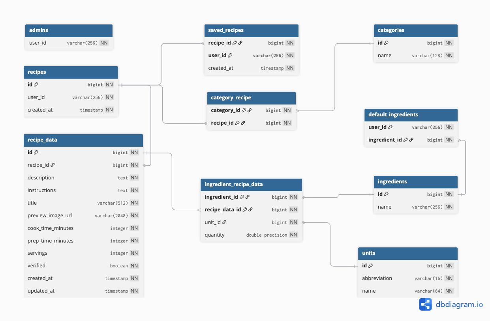

# Find Your Dinner. - Full-stack web app dokumentációja

## 1. Használt technológiák

- **Nyelv**: [TypeScript](https://www.typescriptlang.org/)
- **Full-stack keretrendszer**: [Next.js](https://nextjs.org/) ([React](https://react.dev/))
- **CSS keretrendszer**: [Tailwind CSS](https://tailwindcss.com/)
- **UI komponens könyvtár**: [shadcn/ui](https://ui.shadcn.com/)
- **Ikon készlet**: [Lucide](https://lucide.dev/) + [Simple Icons](https://simpleicons.org/)
- **Animációk**: [Framer Motion](https://www.framer.com/motion/)
- **Űrlapkezelés**: [React Hook Form](https://react-hook-form.com/)
- **API állapot kezelés**: [Tanstack React Query](https://tanstack.com/query/)
- **Validáció**: [Zod](https://zod.dev/)
- **Adatbázis**: [PostgreSQL](https://www.postgresql.org/)
- **ORM**: [Drizzle](https://orm.drizzle.team/)
- **Felhasználókezelés**: [Clerk](https://clerk.com/)

## 2. Production környezet

- **Hosting**: [Vercel](https://vercel.com/)
- **Adatbázis**: [PlanetScale](https://planetscale.com/)
- **Felhasználókezelés**: [Clerk](https://clerk.com/)

## 3. Adatbázis séma



### 3.1. Adatbázis séma generálása

1. Futtasd a `dbml` receptet, ami létrehozza a `web/schema.dbml` fájlt az adatbázis séma alapján.

```bash
just dbml
```

2. Ezután töltsd fel a `web/schema.dbml` fájlt a [dbdiagram.io](https://dbdiagram.io/) oldalra, majd töltsd le a generált képet és írd felül a `docs/media/db.png`-t.

## 4. API dokumentáció (Swagger)

Az infra elindítása után (lsd.: [Infrastruktúra / Fejlesztői környezet dokumentációja](../infra/README.md)), <http://swagger.localhost> vagy <http://swagger.vm1.test> címen érhető el.

### 4.1. API dokumentáció generálása

Az `infra/swagger/openapi.yaml` fájl **AI generált**!

#### 4.1.1. Első generáláshoz használt prompt:

```
scan all the api endpoints inside the web/api folder and generate an OpenAPI 3.1 specification, override the infra/openapi.yaml file with the generated specification

check the zod schemas and set propper minimum, and maximum values, exclusiveMinimum and format for number fields, set string minimum and maximum length, and enum values if possible
```

_Claude Code - Claude Opus 4.6_

#### 4.1.2. Frissítéshez használt prompt:

```
scan the web/api folder and update the infra/openapi.yaml accordingly

check the zod schemas and set propper minimum, and maximum values, exclusiveMinimum and format for number fields, set string minimum and maximum length, and enum values if possible
```

_Claude Code - Claude Opus 4.6_

## 5. Autentikáció és jogosultságkezelés

Felhasználókezeléshez a [Clerk](https://clerk.com/) szolgáltatást használjuk.

A felhasználók adatait (pl.: név, e-mail cím, profilkép, csatolt Google fiók, stb...) a Clerk kezeli, a mi adatbázisunkban ezeket az adatokat nem tároljuk! Az egyéni Clerk által generált azonosító alapján hivatkozunk a felhasználókra.

Bejelentkezett státusz ellenőrzéséhez, felhasználók adatainak lekérdezéséhez, kezeléséhez a `@clerk/nextjs` csomag használható. Hozzá tartozó dokumentáció: <https://clerk.com/docs/nextjs>.

### 5.1. Jogosultsági szintek

| Szint                      | Leírás                                                                                                           |
| -------------------------- | ---------------------------------------------------------------------------------------------------------------- |
| Publikus                   | Bejelentkezés nélkül elérhető tartalmak megtekintése (csak jóváhagyott receptek)                                 |
| Bejelentkezett felhasználó | Saját receptek kezelése (létrehozás, szerkesztés, törlés), receptek mentése, alapértelmezett hozzávalók kezelése |
| Admin                      | Receptek jóváhagyása, kezelése, kategóriák, hozzávalók, mértékegységek kezelése                                  |

Az adminisztrátorok Clerk által generált egyedi azonosítója az `admins` táblában van eltárolva. Ez alapján ellenőrizzük, hogy a felhasználó adminisztrátor-e vagy sem.

#### 5.1.1. Adminisztrátor hozzáadása

Új adminisztrátor hozzáadásához az `admins` táblába kell felvenni a felhasználó egyedi azonosítóját. Seedelés előtt ez a `web/scripts/seeders/seed-admins.ts` fájl `data` tömbjének kiegészítésével tehető meg. (lsd.: [Első indítás](../README.md#első-indítás))

#### 5.1.2. Adminisztrátori jogosultág ellenőrzése

- Szerver oldalon a `web/src/server/utils/check-is-admin.ts` fájlban található `checkIsAdmin` segédfüggvénnyel tehető meg.
- Egyéb esetben az `/api/user/is-admin` végpont hívásával ellenőrizhető.
